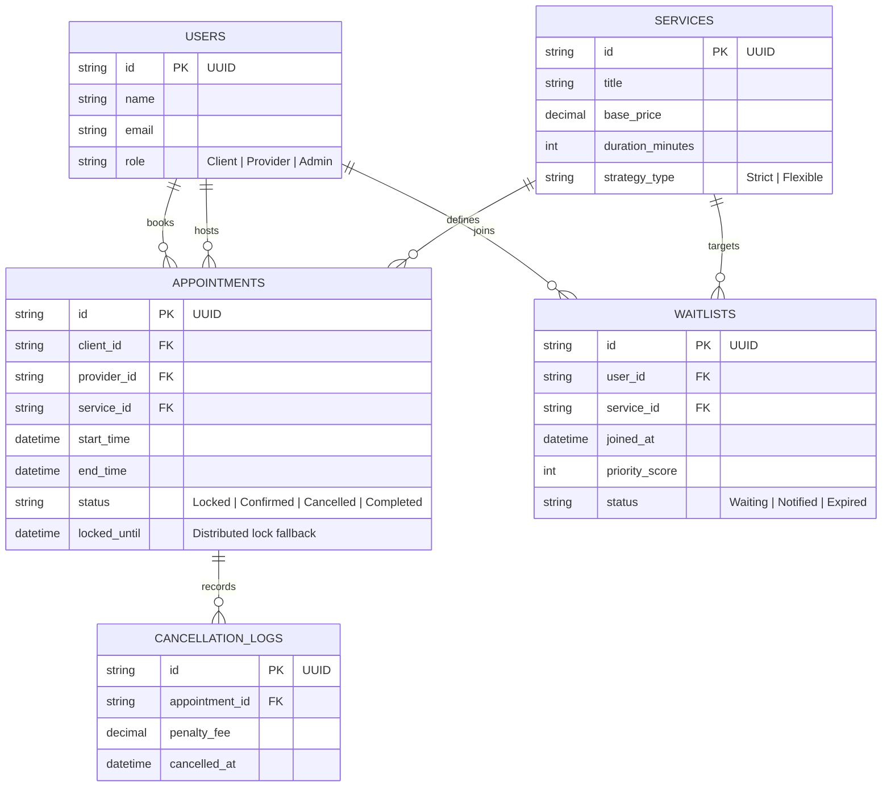

# ER Diagram – SmartSlot

```mermaid
---
config:
  layout: dagre
---
erDiagram

    %% Relationships
    USERS ||--o{ APPOINTMENTS : books
    USERS ||--o{ APPOINTMENTS : hosts
    USERS ||--o{ WAITLISTS : joins

    SERVICES ||--o{ APPOINTMENTS : defines
    SERVICES ||--o{ WAITLISTS : targets

    APPOINTMENTS ||--o{ CANCELLATION_LOGS : records

    %% Entities

    USERS {
        string id PK "UUID"
        string name
        string email
        string role "Client | Provider | Admin"
    }

    SERVICES {
        string id PK "UUID"
        string title
        decimal base_price
        int duration_minutes
        string strategy_type "Strict | Flexible"
    }

    APPOINTMENTS {
        string id PK "UUID"
        string client_id FK
        string provider_id FK
        string service_id FK
        datetime start_time
        datetime end_time
        string status "Locked | Confirmed | Cancelled | Completed"
        datetime locked_until "Distributed lock fallback"
    }

    WAITLISTS {
        string id PK "UUID"
        string user_id FK
        string service_id FK
        datetime joined_at
        int priority_score
        string status "Waiting | Notified | Expired"
    }

    CANCELLATION_LOGS {
        string id PK "UUID"
        string appointment_id FK
        decimal penalty_fee
        datetime cancelled_at
    }
```
