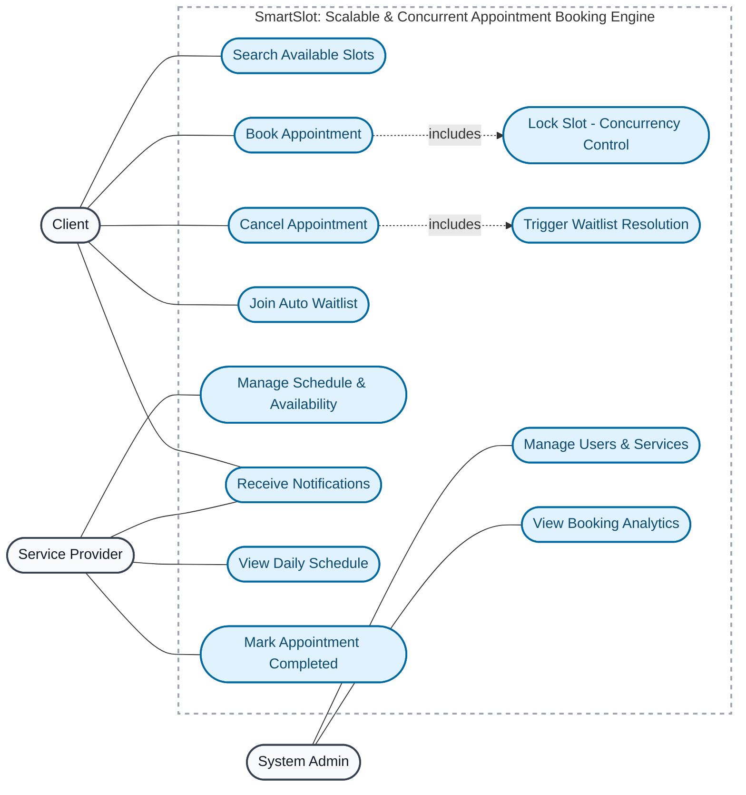

# Use Case Diagram – SmartSlot

```mermaid
---
config:
  layout: dagre
---
flowchart LR

    %% System Boundary
    subgraph System["SmartSlot: Scalable & Concurrent Appointment Booking Engine"]
        direction TB
        UC1(["Search Available Slots"])
        UC2(["Book Appointment"])
        UC3(["Lock Slot - Concurrency Control"])
        UC4(["Cancel Appointment"])
        UC5(["Join Auto Waitlist"])
        UC6(["Trigger Waitlist Resolution"])
        UC7(["Manage Schedule & Availability"])
        UC8(["Manage Users & Services"])
        UC9(["Receive Notifications"])
        UC10(["View Daily Schedule"])
        UC11(["Mark Appointment Completed"])
        UC12(["View Booking Analytics"])
    end

    %% Include Relationships
    UC2 -. includes .-> UC3
    UC4 -. includes .-> UC6

    %% Actors
    Client(["Client"])
    Provider(["Service Provider"])
    Admin(["System Admin"])

    %% Client Interactions
    Client --- UC1
    Client --- UC2
    Client --- UC4
    Client --- UC5
    Client --- UC9

    %% Provider Interactions
    Provider --- UC7
    Provider --- UC10
    Provider --- UC11
    Provider --- UC9

    %% Admin Interactions
    Admin --- UC8
    Admin --- UC12

    %% Styling
    classDef actor fill:#f9fafb,stroke:#374151,stroke-width:2px,color:#111827
    classDef usecase fill:#e0f2fe,stroke:#0369a1,stroke-width:2px,color:#0c4a6e,rx:25,ry:25
    classDef boundary fill:none,stroke:#9ca3af,stroke-width:2px,stroke-dasharray:5 5

    class Client,Provider,Admin actor
    class UC1,UC2,UC3,UC4,UC5,UC6,UC7,UC8,UC9,UC10,UC11,UC12 usecase
    class System boundary
```
